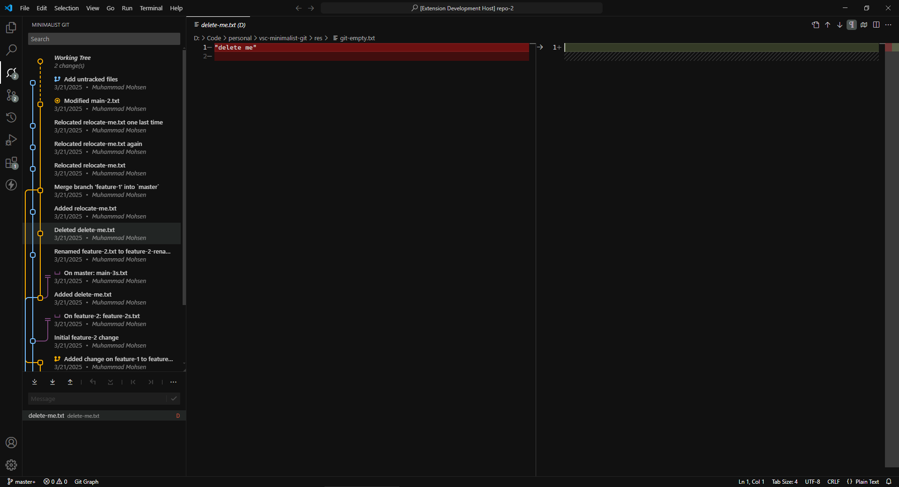
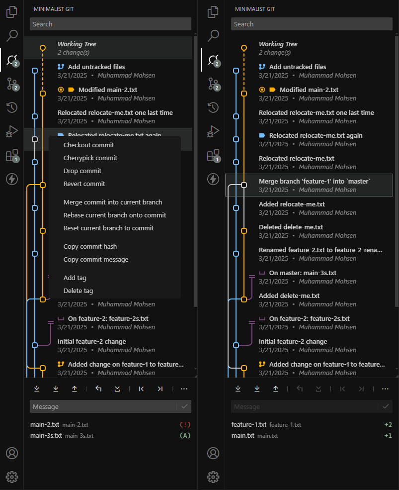

# Minimalist Git
Interactive log graph, working tree & commit diffs, and integrated git commands.

## Features
- Commit log with graph for all branches (includes working tree + stashes)
- Filter log by:
	- author
	- message (--grep)
	- date (--before, --after)
- stackable filters: can simply type `grep: test commit author: john doe before: 5 apr 2025` in the searchbox
- Diff two commits
- Add/Delete tags
- Save/Drop/View stashes
- continue/skip/abort rebase/cherry-pick/merge
- Cookie-cutter commands:
	- fetch
	- pull `--rebase --autostash`
	- push + push `--force`
	- commit + commit `--amend`
	- stage + unstage
	- discard
- Commit commands
	- revert/checkout/cherry-pick commit
	- merge to current branch
	- reset to commit `--hard`
- Change repository author

theme: [VSCode Minimalist Theme (Oak)](https://marketplace.visualstudio.com/items?itemName=MuhammadMohsen.vsc-minimalist-theme)

## Visual Studio Marketplace
This extension is available on the [Visual Studio Marketplace](https://marketplace.visualstudio.com/items?itemName=MuhammadMohsen.mingit&ssr=false#overview) for Visual Studio Code.

## Known Issues
- The graph only displays the most recent 500 commits.
- No localization support.

## Release Notes

### 0.9.4
- Initial beta release
